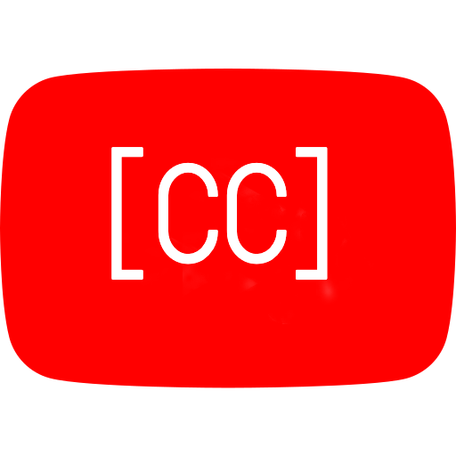

# Youtube-Caption-Viewer

 

A really simple chrome extension to display captions (transcript) from youtube videos for people who are lazy to even watch a video.
Does not need any backend server, just a simple chrome extension.

Introducing the laziest way to watch YouTube videos yet: `Youtube-Caption-Viewer`!.
Open-source chrome extension that lets you read video transcripts without ever hitting that pesky play button.

Perfect for multitasking or just plain ol' procrastinating, `Youtube-Caption-Viewer
Youtube-Caption-Viewer` requires no backend server and minimal brain power. So why waste precious time and energy watching a video when you can just skim the script? Install `Youtube-Caption-Viewer
Youtube-Caption-Viewer` now and take your laziness to the next level!
